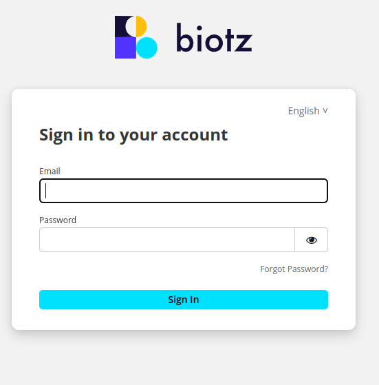

# Get data

After installing the corresponding version you have to login into the app.biotz.io, if you don't have an account, you have to create one first.

The information to create an account is <a href="/docs/Tutorials/Creating a biotz account" target="_self">here</a>.

When you login to app.biotz.io this tab will open with this toolbar:

Go to setup and then go to the data ingestion flow in the search engine. Search for your device.

After doing all this process, you will get an excel that you will have to use later, so save it!

