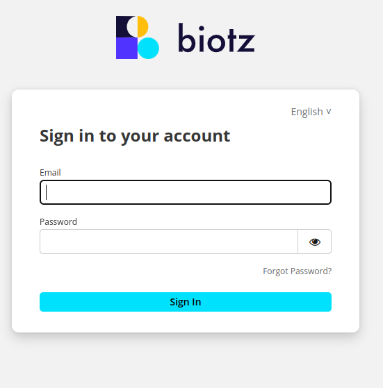
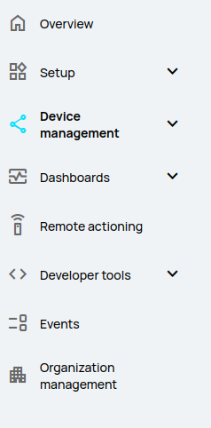

# MQTTX configuration

After installing the corresponding version you have to login into the <a href="https://auth.biotz.io/realms/biotz-platform/protocol/openid-connect/auth?client_id=biotz-platform-spa&redirect_uri=https%3A%2F%2Fapp.biotz.io%2Foverview&state=6a2ba4af-3824-4682-895c-9f1b98bb837a&response_mode=fragment&response_type=code&scope=openid&nonce=86bcf3a0-ba56-4538-8c99-136fc91d06bc&ui_locales=en&code_challenge=p-QGhObRGoSHNiApAA4jDd6X4l9fLh4h53hGmDHnxdw&code_challenge_method=S2cd aca56" target="_self">app.biotz.io</a>, if you don't have an account, you have to create one first.

The information to create an account is <a href="/docs/Tutorials/Creating a biotz account" target="_self">here</a>.

When you log in, this tab will open with this toolbar:

You will have to create a Device.

When creating a device, specific settings can be set for that particular device, such as device type, time zone and tags. This ensures that each device is correctly configured according to its individual needs.

The device registration process also involves the creation of unique credentials for each device, which include a username and password. These credentials are used to authenticate the device when communicating with the platform, ensuring a level of communication security.

The information to create a device is <a href="/docs/Tutorials/Getting started/Step 4 - Creating  a device" target="_self">here</a>.

After creating the device, you will get an excel with some data that you will have to use later, so save it!

After doing all the above mentioned process, you would have to go to the MQTTX application that you installed previously and click on the "+" icon.

Enter the connection details such as the connection name, the MQTT server address, the port, the username and password. You will have this information in the excel you got from app.biotz.io. And the rest of the configuration is on these two pictures:

 
Once you have configured everything correctly, click "Save" or "Connect" to save the configuration and establish the connection.
Once you are connected, you can **post** messages to a specific topic or **subscribe** to a topic to receive messages.