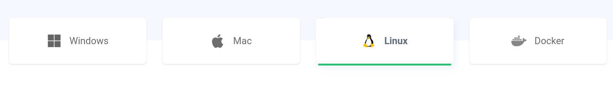
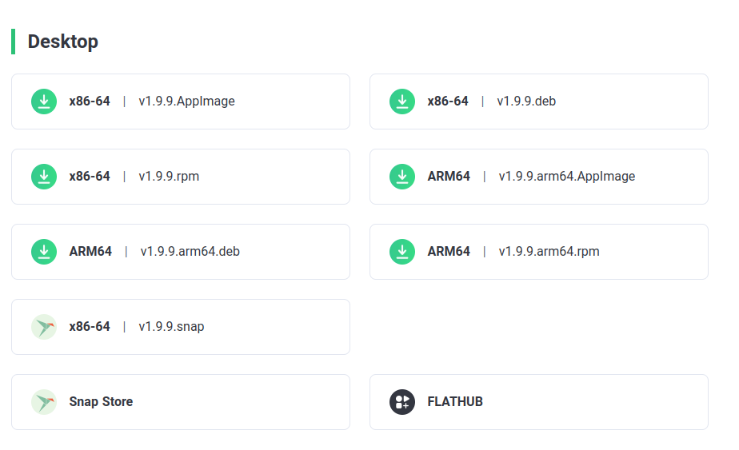
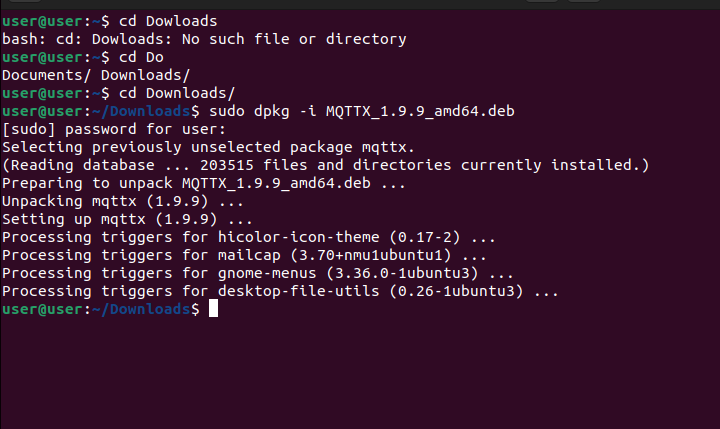

To install MQTTX, first, go to the official MQTTX [website](https://mqttx.app/) On the official page, you need to click in dowload and you will be sent to a page. Here indicate your operating system.

There choose your operating system and download the corresponding version for your operating system.

Once the download is complete, follow the installation instructions for your operating system. In most cases, this will involve simply opening the downloaded file and following the steps in the installation wizard but here is an example of how to install it using commands after dowloading.

