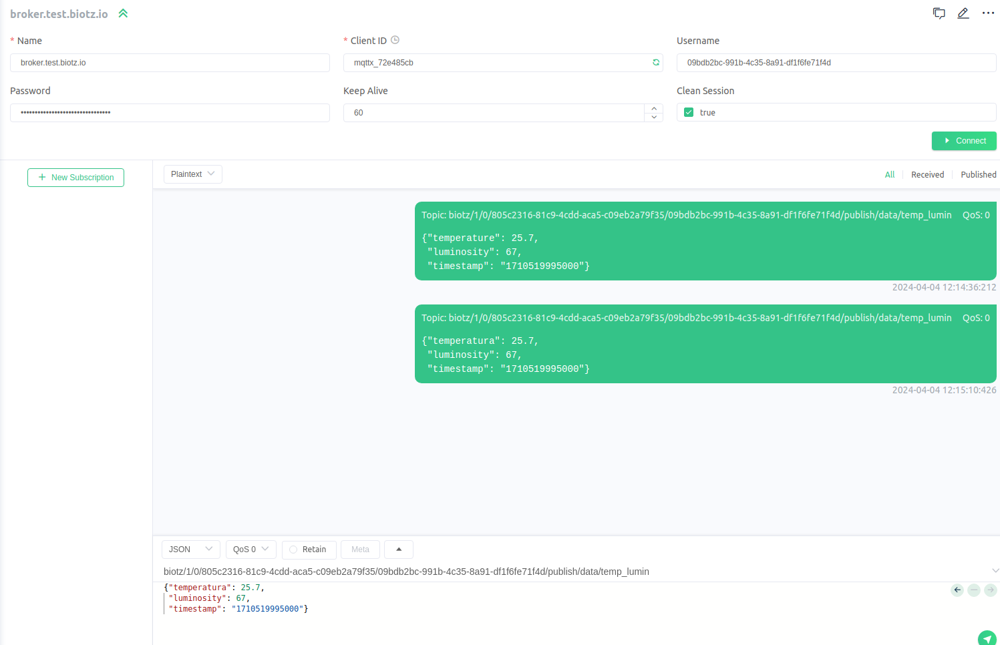
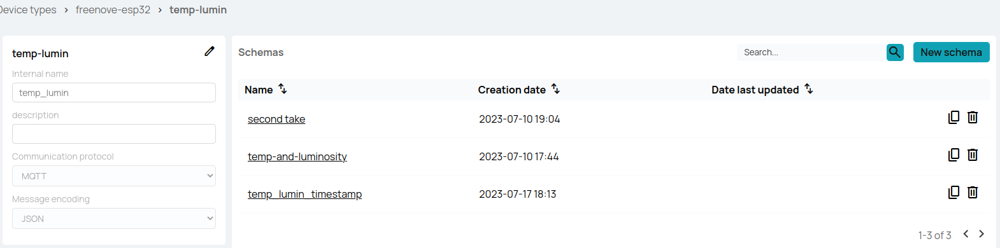

# Publish data to Biotz


This is the mqttx app:

<div class="tutorial-image-container">

</div>

**Post Messages:** You can post messages in different topics on the MQTT servers you are connected to. This allows you to send information to devices subscribed to those topics.

**Subscribe to Topics:** You can subscribe to specific topics to receive messages posted in those topics. This allows you to monitor and receive information from devices and systems that publish data in those topics.

To connect and disconnect in MQTTX you have to use this connect button:

<div class="tutorial-image-container">

</div>
This time you are going to establish connection with Biotz to do a test and **publish** a message.

Next, we will guide you through the process of verifying the successful publication of data to Biotz using our debugging tool.

For this demonstration, we'll focus on a JSON format. We'll provide examples of both correct and incorrect JSON payloads to illustrate the testing process.

## Correct message
To send the message, you will have to modify the topic, the topic is a string that is used to identify the destination of a message. It serves as a kind of address or channel to which the message is sent and to which other users can subscribe to receive messages related to that specific topic.
 
<div class="tutorial-image-container">

</div>

There is a standard format of the MQTT topics for sending data from devices to the Biotz IoT Platform:
```
biotz/1/0/CUSTOMER-ID/DEVICE-ID/publish/data/MESSAGE-TYPE-INTERNAL-NAME
```
Here it will be important to put the data you obtained from excel correctly.The part of biotz/1/0/ you should leave it as it is in the standard. In CUSTOMER-ID you will have to write the id of the Customer Id that you have in the excel you obtain before, in DEVICE-ID, the Device Id that you have also obtained and you have in the excel, publish/data you shouldn't change it, leave it as it is in the example.
MESSAGE-TYPE-INTENAL-NAME makes reference to the already registered message type in Biotz. This is the message type we want to simulate through this test and that is why we must include it in the topic correctly.

To know what to write in MESSAGE-TYPE-INTERNAL-NAME, you have to go to app.biotz.io and data ingestion flow, enter the name of the device type that you are using and look at the internal name that corresponds to it, that will be what you will have to write in topic. 

<div class="tutorial-image-container">

</div>

After that, you will see all the message-types that corresponds to the device-type you search for. Look at the internal name that corresponds to the message  type you want to test, that will be what you will have to write in topic. 

<div class="tutorial-image-container">

</div>

The topic should look something like this:
```
biotz/1/0/805c2316-81c9-4cdd-aca5-c09eb2a79f35/09bdb2bc-991b-4c35-8a91-df1f6fe71f4d/publish/data/temp_lumin
```

To send the message, first you will have know the message type and the schema you are going to use to send the message. 

For that, you will have to go back to **data ingestion flow** and select the **device type** you are using. This will bring you to a tab that, on the left will display you the message type and one the right, all the schemas for that message type, 

<div class="tutorial-image-container">

</div>

You will have to select the specific schema, to know the correct structure of what your device will send to the platform.

<div class="tutorial-image-container">

</div>
After looking at the attributes, you have to write the correct JSON payload between the braces. The message would look something like this. Depending on the attributes you need to use. 

<div class="tutorial-image-container">

</div>
After all this, you can send the message with the green button below.
<div class="tutorial-image-container">

</div>

You will return to app.biotz.io, this time you will enter in developer tools, and inside developer tools in communications debugger. You will see this box with two pieces of information to fill in:

<div class="tutorial-image-container">

</div>

In select device, type the name of the device you created before and in the select message type the message-type that you have configured, in this case, temp-lumin.

If the message has been sent correctly to the device you wanted, this is what should appear:
<div class="tutorial-image-container">

</div>
As we can see if everything went well, the payload you have sent would match the schema  and you will see something like this, the green circle will indicate that payload have the same structure that the schema, that means that you have sent the JSON payload with the correct format.

## Incorrect message
Now let's modify something in the payload that doesn't match the schema, send it to see the difference.

Instead of "temperature", let's type "temperatura" and see how it changes.
If you have changed "temperature" to "temperatura", now the message you are going to send should look like this:

<div class="tutorial-image-container">

</div>

<div class="tutorial-image-container">

</div>
When you go back to communication debugger now this is what will appear, as you can see, now the circle is orange and an error appears,"no-valid-schema-found-for-given-message". This is because the format is not of the same structure as the schema and even if the message arrives without problem, the orange circle will appear.

With this tutorial you have learned how to establish a connection and publish messages to Biotz via MQTTX.
