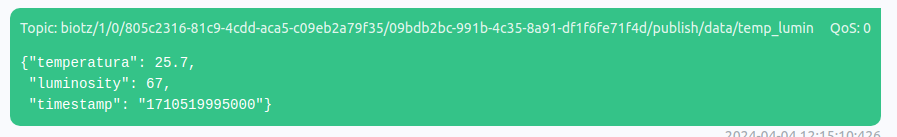

# Sending the message

After doing all the above mentioned process, you would have to go to the MQTTX application that you installed previously and click on the "+" icon.

<div class="tutorial-image-container">

</div>
Enter the connection details such as the connection name, the MQTT server address, the port, the username and password. You will have this information in the excel you got from app.biotz.io. And the rest of the configuration is on these two pictures:

<div class="tutorial-image-container">

</div>
<div class="tutorial-image-container">

</div> 
Once you have configured everything correctly, click "Save" or "Connect" to save the configuration and establish the connection.
Once you are connected, you can post messages to a specific topic or subscribe to a topic to receive messages.

To post messages, click on the "Post" icon and fill in the message and topic details.
To subscribe to a topic, click on the "Subscribe" icon and enter the name of the topic you wish to subscribe to.


This time you are going to do a test to publish a message and establish a connection with Biotz.

You are going to create two different messages, one will be incorrect and one will be correct, and you will see the difference between both.

## Message with wrong JSON payload
In topic, you will have to write something similar to this with the data of the excel. Aqui sera importante poner cada dato correctamente para que al establecer la conexion, sea correcto.
```
  biotz/1/0/d12af5ca-6120-494e-90e4-63a4036f45f9/dcbed620-4992-4695-8207-25e889b9e0c3/subscribe/action/data
```

And between the braces, the following JSON payload
```JSON
 "msg": "hello"
```

When doing that, this is what you will send:

<div class="tutorial-image-container">

</div>


You will return to app.biotz.io, this time you will enter in developer tools, and inside developer tools in communications debugger. You will see this box with two pieces of information to fill in:

<div class="tutorial-image-container">

</div>

In select device, write the name with which we have sent the message and in the select message type the type of message that you have configured, in this case, temp-lumin.

If you have sent the first message you will see this:

<div class="tutorial-image-container">

</div>

As you can see, the following error will appear, this indicates that the message is not sent correctly. The message appears to be a simple JSON object with a key "msg" and a value "hello". If the receiving system expects a specific format or is configured to process only certain types of messages, it may generate an error when receiving a message with a different format.

Now you will return to MQTTX app and you will send it in this other way.

## Message with correct JSON payload

You are going to publish the message in another way so that it works, and this time there will be no errors, so the message will be sent correctly.

You will need to replace what was inside the braces with this JSON payload:

```JSON
"temperature": 25.7,
"luminosity": 67,
"timestamp": "1710519995000"
```
This message appears to be a data set that includes temperature and luminosity information, along with a timestamp. 
When doing that, this is what you will send:

<div class="tutorial-image-container">

</div>

Then return to app.biotz.io and by doing the same process you did when sending the wrong message, this is what you'll encounter this time.

<div class="tutorial-image-container">

</div>

As you can see in the image, this time there are no errors because the message formatting is correct.
In this way, you have been able to establish a connection with Biotz using the MQTTX app.

to connect and disconnect in MQTTX you have to use this connect button
<div class="tutorial-image-container">

</div>