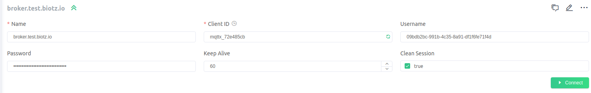

# Publish data to Biotz

To post messages, click on the "Post" icon and fill in the message and topic details.
To subscribe to a topic, click on the "Subscribe" icon and enter the name of the topic you wish to subscribe to.
To connect and disconnect in MQTTX you have to use this connect button
<div class="tutorial-image-container">

</div>
This time you are going to do a test to publish a message and establish a connection with Biotz.

Next, we will guide you through the process of verifying the successful publication of data to Biotz using our debugging tool.

For this demonstration, we'll focus on a JSON format. We'll provide examples of both correct and incorrect JSON payloads to illustrate the testing process.

## Correct message
Now, you will have to modify the topic, the topic is a string that is used to identify the destination of a message. It serves as a kind of address or channel to which the message is sent and to which other users can subscribe to receive messages related to that specific topic.
 
<div class="tutorial-image-container">

</div>

There is a standard format of the MQTT topics for sending data from devices to the Biotz IoT Platform:
```
biotz/1/0/CUSTOMER-ID/DEVICE-ID/publish/data/MESSAGE-TYPE-INTERNAL-NAME
```
Here it will be important to put the data you obtained from excel correctly. In CUSTOMER-ID you will have to write the id of the Customer Id that you have in the excel you obtain before, in device id, the Device Id that you have also obtained and you have in excel, publish/data leave it the same.

To know what to write in MESSAGE-TYPE-INTERNAL-NAME, you have to go to app.biotz.io and data ingestion flow, enter the name of the device type that you are using and look at the internal name that corresponds to it, that will be what you will have to write in topic. 

<div class="tutorial-image-container">

</div>
<div class="tutorial-image-container">

</div>


The topic should look something like this
```
biotz/1/0/805c2316-81c9-4cdd-aca5-c09eb2a79f35/09bdb2bc-991b-4c35-8a91-df1f6fe71f4d/publish/data/temp_lumin
```

To send the message, first you will have to know the format in which you will have to send the message, for that you will have to go back to data ingestion flow and select the device type you are using and look at its attributes.

<div class="tutorial-image-container">

</div>
After looking at the attributes, you have to write the correct JSON payload between the braces. The message would be something like this.
<div class="tutorial-image-container">

</div>
After all this, you can send the message with the green button below. 
<div class="tutorial-image-container">

</div>
You will return to app.biotz.io, this time you will enter in developer tools, and inside developer tools in communications debugger. You will see this box with two pieces of information to fill in:

<div class="tutorial-image-container">

</div>

In select device, write the name with which we have sent the message and in the select message type the type of message that you have configured, in this case, temp-lumin.

If you have sent the message you will see this:

<div class="tutorial-image-container">

</div>
As we can see if everything went well, the message will have been sent correctly and you will see something like this, the green circle will indicate that the message is correct, that means the format of the message is correct.

## Incorrect message
Now let's modify something in the payload to send the message incorrectly to see the difference.

You will need to replace what was inside the braces with this JSON payload:
<div class="tutorial-image-container">

</div>

Instead of "temperature", let's type "temperatura" and see how it changes.
<div class="tutorial-image-container">

</div>
When you go back to communication debugger now this is what will appear, as you can see, now the circle is orange and an error appears."no-valid-schema-found-for-given-message".This is because the format is not correct now.

With this tutorial you have learned how to establish a connection and publish messages to Biotz via MQTTX.
