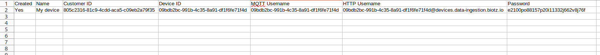

# Getting the token

To get the token needed for authorization when sending our request, you must first follow these steps.

**Getting the necessary data:**

First you will have to **create a device**, to create the device, you will have to choose the **device type** you are going to use, the **message type** you are going to use and the **schema**. If you have not created these, you can create it step by step following <a href="/docs/Tutorials/Getting started/Step 1 - Creating a Device Type" target="_self">this link</a>.

After creating the schema, you will get an excel with some important data that you will have to save for later use. 

<div class="tutorial-image-container">

</div> 

Once you have saved all these data, you must follow a few steps to get the token.

**Now, you must go to the terminal.**

Once in the terminal, to get the token, you have to write this bash in the terminal:
```bash title="HTTPie"
http --form POST \
https://auth.biotz.io/realms/biotz-platform/protocol/openid-connect/token \
username=~HTTP USER FROM CSV~ \
password=~PASSWORD FROM CSV~ \
grant_type=password \
client_id=biotz-platform-devices \
scope=openid

```
Then, you have to change the username and password for the excel data, where it says "\~HTTP USER FROM CSV~", you must write the http username of your CSV, and where it says "\~PASSWORD FROM CSV~" what it is in the password of the CSV, the rest of the information is left as is.

Now, if you have done everything correctly by pressing enter, you should see three different tokens in the terminal, and at the bottom of the terminal, the token type. 
The token you will need to the authorization, is the id_token.

### Obtaining Access Tokens with Postman

1. **Open Postman**: Launch the Postman application on your device.

2. **Create a New Request**: Start a new request by clicking on the "New" button in Postman.

3. **Configure Request**:
   - **Method**: POST
   - **URL**: `https://auth.biotz.io/realms/biotz-platform/protocol/openid-connect/token`

4. **Set Request Body**:
   - Navigate to the "Body" tab within the request settings.
   - Select "form-data" as the body type.
   - Add the following key-value parameters:
     - `username`: ~HTTP USER FROM CSV~
     - `password`: ~PASSWORD FROM CSV~
     - `grant_type`: password
     - `client_id`: biotz-platform-devices
     - `scope`: openid

5. **Configure Variables**:
   - Ensure that the values of `username` and `password` are configured as environment variables or input directly into Postman.

6. **Send Request**: Click on the "Send" button to execute the request.

7. **Review Response**: Upon successful authentication, the response will contain the access token generated by the Biotz authentication server.

### Notes
- This request is designed to authenticate with the Biotz authentication server and obtain access tokens.
- Ensure that you replace placeholders (`~HTTP USER FROM CSV~`, `~PASSWORD FROM CSV~`) with actual values.
- The access token obtained can be used to authorize subsequent requests to Biotz API endpoints.
