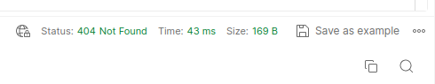

You have already got the token, now it is time to send the request.

Now go back into postman. Add a tab, you are going to send a request. Introduce, the link, then go to authorization, in this tab, you will have to write the token that they have given you in the terminal, to be more concrete, the id_token, to the left will appear the type of token that we need for the authorization, which in this occasion is Bearer. Then, where it says type, you will have to put the type to which it corresponds that is the bearer token. 

Now click on body and choose raw. Inside raw you will have to change to the format json. 

To write the correct json payload, you will have to write in the correct format, to know which is the correct format, you will have to go to the app.biotz.io and look for which is your format because it will depend on the format that you send the message will have been sent correctly or not.

After writing the json payload you can send the message and if everything went well you should see this at the bottom. 

Now you can go back to app.biotz.io to check if the request has been sent correctly.

For that you will have to go to developer tools and inside developer tools to the communication debugger, there will be two spaces to fill, in the first one you will have to choose the device that you have created, and in the second one, the device type that you have used.

If the message has been sent correctly, it should appear something like this, the green circle, indicating that the request has been done correctly.

However, now we are going to try to send the request in this other way, in luminosity, the value to send should be an integer but you are going to send a number that is not an integer and you are going to see what happens.

As you can see the request is correct but when you enter again in the communication debugger, you will see that now the circle is orange, that indicates something is wrong. 
So you can see that it is important to be strict with the JSON format. 

If when you send the request you get this:

 
It is probably because the authentication token has expired and you will have to get a new one, if you are not sure how to get the token you can look again at getting the token.

