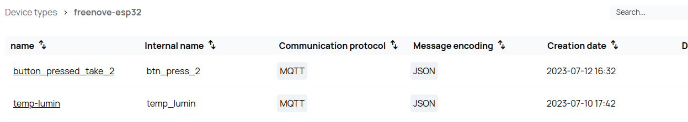

You have already got the token, now it is time to send the request.

Now go back into postman. You are going to create a new request.

In the postman application, you will have something like this above:

<div class="tutorial-image-container">

</div>

Add a new request by clicking, the "+" icon. 

Then, you will need to introduce the http url that you want to do the request, in this case the url would be similar to this:

```
https://ingestion-http.biotz.io/api/device/publish/data/mytestmessag \
```

Remember, that where it is "mytestmessag \" , you will have to enter the name of your own message type, to see that you should go back to app.biotz.io and in data ingestion flow, there search for your device type.
This is what will appear:

<div class="tutorial-image-container">

</div>

Then click on that device type and there will be all the message types of the device type.

<div class="tutorial-image-container">

</div>

In the second column you can see the internal name of each one, look for yours and write the internal name that corresponds instead of "mytestmessag \". 

Then go to authorization.

This would be what you will find when you click on authorization:

<div class="tutorial-image-container">

</div>

In this tab, you will have to write the token that they have given you in the terminal, to be more concrete, the **id_token**.

1. To the left will appear the type of token that we need for the authorization, which in this occasion is Bearer.
    
2. Then, on the right, will be a box to put the token obtained previously, remember that you have to type the **id_token**.


Now click on body and choose raw. 

On the right you can see "JSON" and if you click there you will can see different options, choose the JSON option because our request will be send by a JSON payload.

<div class="tutorial-image-container">

</div>

To write the correct JSON payload, you will have to write the message depending on the structure of the specific schema you have created. 

To know which is the schema, you will have to go to the app.biotz.io Now, click on **data-ingestion flow** and search for the **device-type** you are using. Inside the device-type select the **message-type**.

<div class="tutorial-image-container">

</div>

After that on the right will be all the created schemas for that message type, select the one you are using.

<div class="tutorial-image-container">

</div>

As you will see, your schema will look something like this, you should use the structure of that schema and the data to create the right JSON payload.

<div class="tutorial-image-container">

</div>

The JSON payload should look something similar to this:

<div class="tutorial-image-container">

</div>


After writing the JSON payload you can send the message and if everything went well you should see this at the bottom. 

<div class="tutorial-image-container">

</div>

<div class="tutorial-image-container">

</div>

Now you can go back to app.biotz.io to check if the request has been sent correctly.

For that you will have to go to back to app.biotz.io.

Now you need to enter on **developer tools** and inside developer tools on the **communication debugger**, there will be two spaces to fill, in the first one you will have to choose the device that you have created, and in the second one, the device type that you have used.

<div class="tutorial-image-container">

</div>


If the message has been sent correctly, it should appear something like this, the green circle, indicating that the request has been done correctly.

<div class="tutorial-image-container">

</div>

However, now we are going to try to send the content of the request in this other way:

<div class="tutorial-image-container">

</div>

In luminosity, the value to send should be an integer but you are going to send a number that is not an integer and you are going to see what happens.


As you can see the request is correct but when you enter again in the communication debugger, you will see that now the circle is orange, that indicates something is wrong. 
The problem is that the message content doesn't comply with the registered schema.

<div class="tutorial-image-container">

</div>

If when you send the request you get this:

<div class="tutorial-image-container">

</div>
<div class="tutorial-image-container">

</div> 
It is probably because the authentication token has expired and you will have to get a new one, if you are not sure how to get the token you can look again at <a href="/docs/Examples/POSTMAN/Getting the token" target="_self">getting the token</a>.


