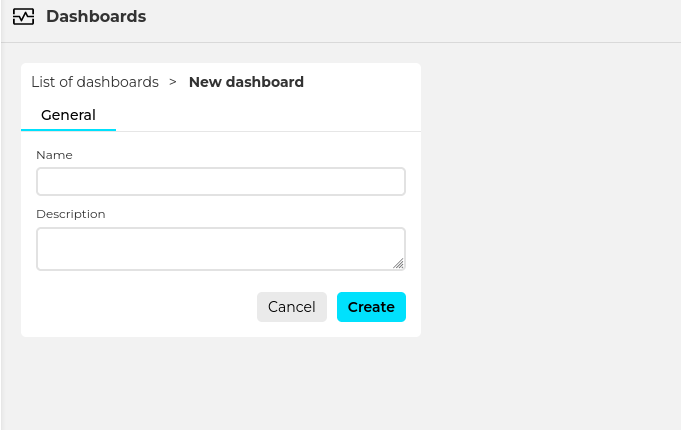
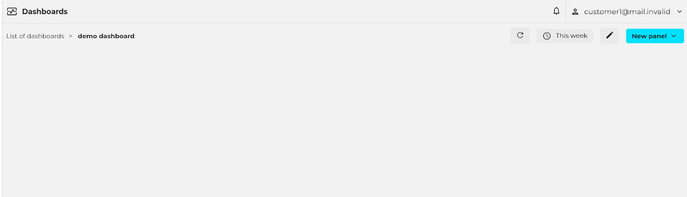
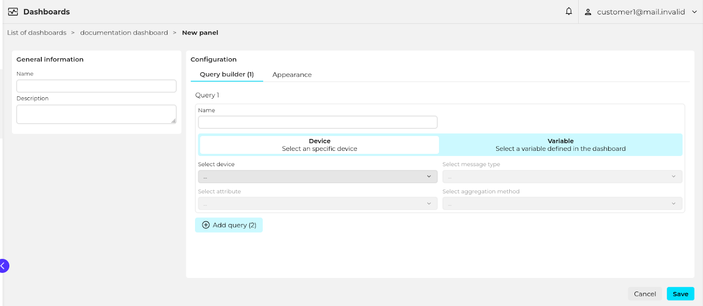
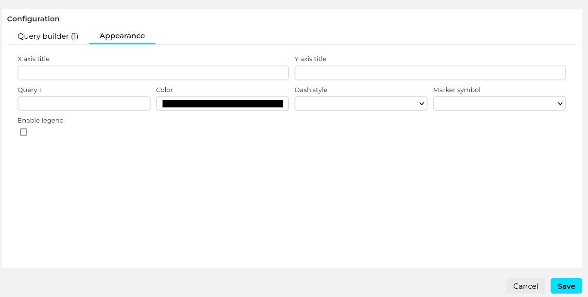

# How to create a dashboard

## Introduction

Biotz provides a dashboarding tool that can be used to visualize the data coming from the devices.

## Prerequisites

In order to create a dashboard having a device-type with at least one message type and schema is required. Having a device that has already sent some data is also recommended to visualize the created panels straight away and have a faster feedback loop.

## Creating a dashboard

Dashboards are created from the “Dashboards” list. Just a name and an optional description are requested.

    

When clicking on “create” an empty dashboard is created.

## Creating panels

A dashboard is composed of one or more panels. To create a new one use the “New panel” button and select the type of panel to create.
  

At the moment the available panel types are the following: time-series, pie chart and gauge.

    

### General information

Name the panel and optionally set a description.
  

### Configuration

(make this type dependent)

**Time series**

###### Query builder

The query builder is used to define which data will the panel display.  The x-axis will always be the time, and the y axis will contain one or more time-series lines. Each line is defined by an independent query.
  
Defining a query requires the following configuration:

- Selecting a device or device variable. Each line in the chart can show the data of a single device. The device to be used can be fixed and defined at panel creation time, or determined by a dashboard variable (see <a href="./How to use dashboard variables" target="_self">this</a> for more info).
- Message type and attribute. Each line in the chart can show the data of a single message type attribute.
- Aggregation method. The method used to aggregate the devices data to adapt the number of displayed points to the user's screen size and zoom level.

**Attribute type and Available aggregation methods**

- Numeric: Count, maximum, minimum, mean, standard deviation, and sum.
- Boolean: Count
- Text: Count

  

The reason for aggregating the data is performance. Lets say a certain device is sending data observations every second, and the user wants to display the data of a whole month. That would result in 2,678,400 data points. Displaying so many data points would be technically impossible for the browser because of the limited amount of pixels that a screen can display. Also, it would be very CPU heavy. To avoid that, the dashboard panel aggregates data to adapt to the screen size and chosen zoom level.

###### Appearance

The following appearance related options are available:
- X axis title
- Y axis title
- Series appearance (configurable for each of them)
- Display name
- Color
- Dash style
- Marker symbol
- Enable/disable legend

##### Gauge

###### Query builder

The query builder is used to define which data will the gauge display. A gauge shows the aggregation of a certain device message-type attribute in the selected time-frame period.

Defining the query requires the following configuration:

- Selecting a device or device variable. Each gauge can show the data of a single device. The device to be used can be fixed and defined at panel creation time, or determined by a dashboard variable (see <a href="./How to use dashboard variables" target="_self">this</a> for more info).
- Message type and attribute. Each gauge can work with a single attribute.
- Aggregation method. The data for the selected device and attribute will be aggregated using this method. Note that the special “first” and “last” aggregation methods are also available that show a single data point.
‍

##### Attribute type and Available aggregation methods

- Numeric: Count, maximum, minimum, mean, standard deviation, sum, first and last.
- Boolean: Count, first and last.
- Text: Count, first and last.
‍

###### Appearance
The following appearance related options are available:

- Min value
- Max value
- Unit
- Thresholds: the gauge can represent multiple threshold values using colors.
- Percentage
- Color

##### Pie chart

###### Query builder
The query builder is used to define which data will the pie chart display. Each segment of the pie is defined by an independent query that displays the aggregation of a certain device message type attribute.

‍

Defining the query requires the following configuration:

- Selecting a device or device variable. Each pie segment can show the data of a single device. The device to be used can be fixed and defined at panel creation time, or determined by a dashboard variable
(see <a href="./How to use dashboard variables" target="_self">this</a> for more info).
- Message type and attribute. Each pie segment can work with a single attribute.
- Aggregation method. The data for the selected device and attribute will be aggregated using this method. Note that the special “first” and “last” aggregation methods are also available that show a single data point.
‍

##### Attribute type and Available aggregation methods

- Numeric: Count, maximum, minimum, mean, standard deviation, sum, first and last.
- Boolean: Count, first and last.
- Text: Count, first and last.
‍

###### Appearance
The following appearance related options are available:

- Enable/disable legend
- Enable/disable data-labels
- Segments appearance
- Display name
- Color
‍

##### State chart
###### Query builder
The query builder is used to define which data will the state chart display. Each chart can show the data from one variable.

‍

Defining the query requires the following configuration:

- Selecting a device or device variable. The device to be used can be fixed and defined at panel creation time, or determined by a dashboard variable (see <a href="./How to use dashboard variables" target="_self">this</a> for more info).
- Message type and attribute.
- Aggregation method. The data for the selected device and attribute will be aggregated using this method. Note that the special “first” and “last” aggregation methods are also available that show a single data point.
‍

##### Attribute type and Available aggregation methods

- Numeric: Count, maximum, minimum, mean, standard deviation, sum, first and last.
- Boolean: Count, first and last.
- Text: Count, first and last.
‍

###### Appearance
The following appearance related options are available:
- Enable/disable value with unit marker.
- Conditions for different styles, applies the first that's true
- Color
- Text to display
