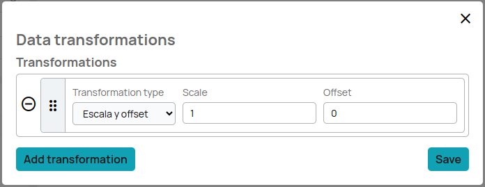

# How to create a schema

## Introduction

When data arrives into Biotz's ingestion system, the received package of data is checked against schemas defined in Biotz. These schemas are the definition of the content of the data package and the user must take care of defining them in the system.
## Prerequisites

In order to create a schema having a deceive-type with at least one message type is required. A schema is directly related to device-type, there can be zero to many schemas.

## Creating a schema

Schemas are created from the Setup > Data ingestion flow > Device-type > Message-type “New schema”

When clicking on “New schema” an empty schema is created.

First thing will be giving a name to the schema, the purpose of this is just to identify it, it is not further used in the communication or data sending.

  

After naming the schema the proper and important specification happens under the ‘Schema definition’ section. It is time to let Biotz know how the sending data is structured. Once ‘Add new item’ is selected, a set of different item types are offered to cover almost all the data sending options:

Detailed specification of the item types is shared in <a href="/docs/Reference guides/Message-type Schema specification"target="_self">here</a>.
‍
- Collection of identical items: collection of more than one identical item. Being an item anything from an object/map/dictionary to singular element as a text, boolean, integer or decimal.
- Collection of unrelated items: collection of any kind of item, present just once.
- Object / Map / Dictionary: They are containers of the final properties, as the collection type items. 1 to n items can be added to this one, they are grouped in two types based on the data needed to define them:
- Unix timestamp (integer)
- Unix timestamp (text)
- Unix timestamp RFC-3339
- Text
- Boolean
- Integer
- Integer, as text
- Integer, as hexadecimal text
- Decimal
- Decimal, as text

These are the descriptions of each of the parameters of an item:

- Item type: the type of the element in the payload.
- Key name: key name in the object/dictionary.
- Item name: the name of the column where this data will be stored.
- Mandatory?
- Can be null?

Timestamp ones, the same as the rest with an extra one:

    - Payload timestamp?: to be marked if this is the timestamp Biotz should use for the time series date mark.

To the following item types, **data transformation** is applicable:

- Integer
- Integer, as text
- Integer, as hexadecimal text
- Decimal
- Decimal, as text

The data transformation functionality allows users to apply scaling and offsetting during data ingestion.
Data transformation includes advanced options such as the application of scaling and offsetting. This feature allows users to adjust their data more precisely during the ingestion process.

#### How to use the Functionality

**Step 1: Access the Ingestion Configuration**

Once on the schema definition screen, select the item type you want to transform, ensuring it is one of the following: integer, integer as text, integer as hexadecimal text, decimal, or decimal as text. After selecting the item type, the "fx" icon will appear next to the item name. Click on this icon to access the data transformation options.

    

**Step 2: Define Transformation Rules with Scale and Offset**

This is what will appear when you click on the "fx" button:

    

Click on "Tranformation type".
Select the type of transformation you want to apply, you can only choose scale and offset.

    

Configure the specific parameters of the transformation.

For example:

    

Scale: 1.5

Offset: -2

This means that each data value will be multiplied by 1.5 and then 2 will be subtracted.

To add more transformations click on the "add tranformation" button, once the setup is done, click on "save". Once the configuration is saved the "fx" button will show a yellow circle to show that the data transformation formulas are stored.

    

 
 

Once the schema is totally represented the ‘save’ button will register the schema. This will create the necessary machinery for the data validation and ingestion, it will also create the needed database structure for the data to be stored.

## Create a schema using the text editor

Apart from the interactive user interface to register a schema, there is a editor mode to perform the same task.

The editor mode provides a more flexible way of registering a schema, but requires advanced knowledge of the structure it must follow.

It can also be used to get a plain text description of the schema that can be copied and saved to local files.

The scheme must be a valid schema to be able to 'save' it.

  

Next step should be setting up the other piece of the communication, the device. This <a href="./How to publish device data" target="_self">other</a>
 how-to guide talks about it.

‍

