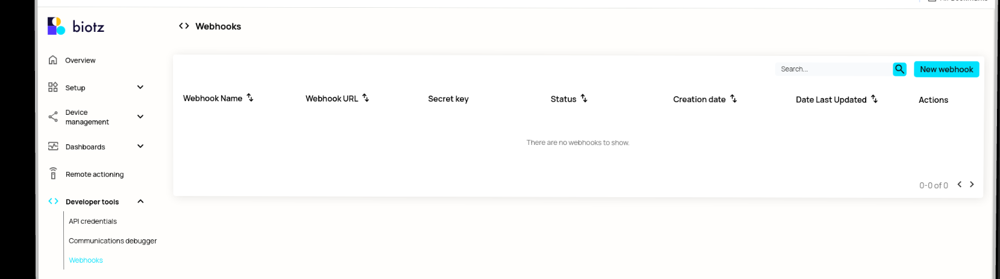
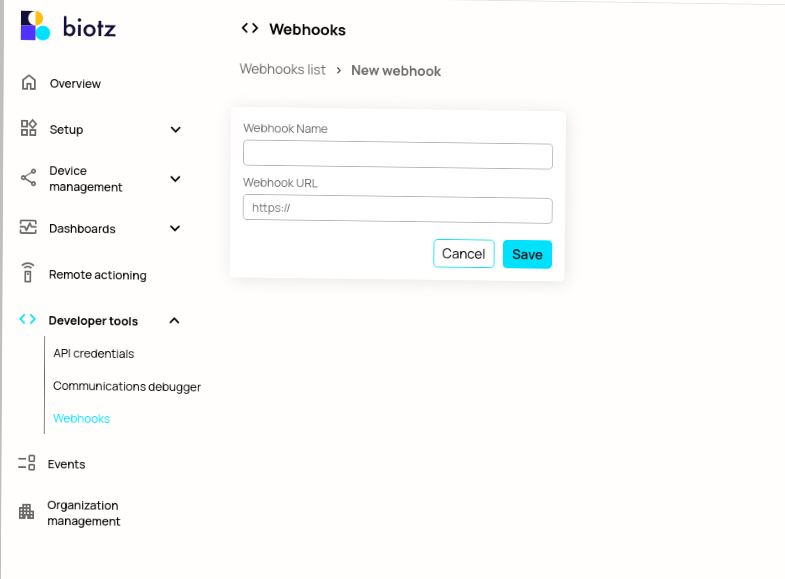
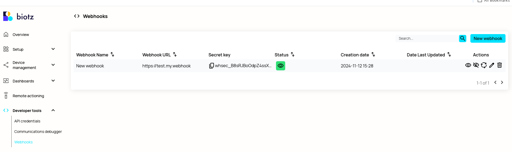
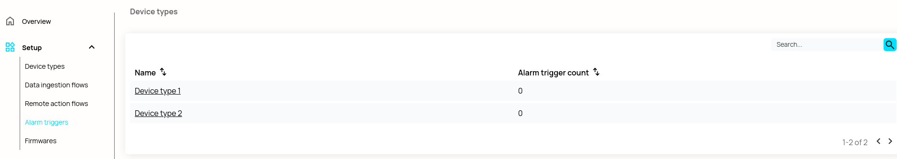
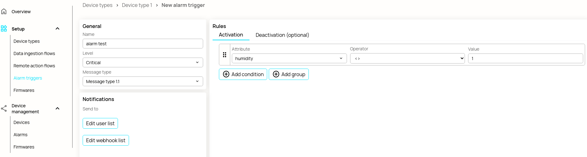
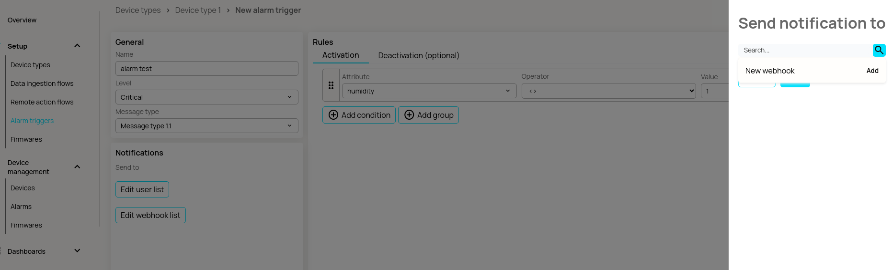

# How to Create and Use Webhooks

## Introduction

Biotz provides webhook subscriptions for its alarms. In short, a <a href="https://en.wikipedia.org/wiki/Webhook">webhook</a> is a method used by one application (e.g., Biotz) to send real-time data to another application (e.g., customers) when a specific event occurs.

## Prerequisites

There are no prerequisites for creating a webhook. However, webhooks are used for device events, so to use them, you need a device type that includes at least one message type and schema. It's also recommended to have a device that has already transmitted some data.

## Creating a Webhook

Webhooks are created from the "Developer Tools" section in the sidebar. To create a webhook, provide a name and the mandatory "callback URL" (i.e., the URL to which the event data will be pushed). Webhooks only support HTTPS URLs.

Clicking "New Webhook" takes you to a form where you can enter the name and URL for your webhook.

Upon clicking "Save," the webhook is created, and a "secret" is automatically generated. It is advised to regenerate the secret regularly.

Now the webhook is ready for use. Don't forget to take note of the webhook's name and secret for later use!

## Registering a Device Alarm with the Webhook

For a webhook to be useful, it must be subscribed to a Biotz event. Currently, only alarm notification events support webhook integration. To add one, navigate to "Alarm Triggers" under the "Setup" section in the sidebar and choose a device type (e.g., Device Type 1).

Then either create or edit an alarm trigger and click "Edit Webhook List."

Search for your webhook by name, add it from the dropdown, and then save. Now you can proceed to actually use the webhook from your app.

## Receiving Webhook Event Data

If all the above steps were followed and there is at least one device that generates alarms, then alarm data will be sent to the webhook URI via POST.

From the client side, there should be validation of the webhook via the "Biotz-IoT-Signature" header entry. The Biotz-IoT-Signature has the following structure:

Biotz-IoT-Signature: t=1492774577,v1=d4e5f6a7b8c9d0e1f2a3b4c5d6e7f8a9b0c1d2e3f4a5b6c7d8e9f0a1b2c3d4e5,

Where the string following t= is a timestamp and the one following `v1=` is the signed payload of the event and is created by first concatenating:

* The string timestamp, the same as the t= part of Biotz-IoT-Signature
* The character `.`
* The actual alarm payload in JSON (the body of the POST request)

And then generating an HMAC-SHA256 hash of the concatenation using the webhook secret key.
