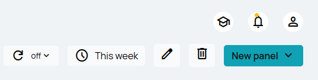
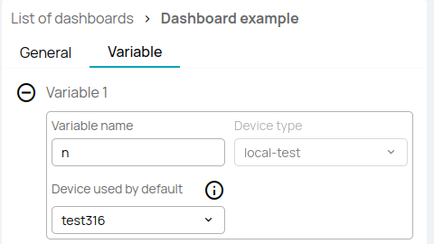
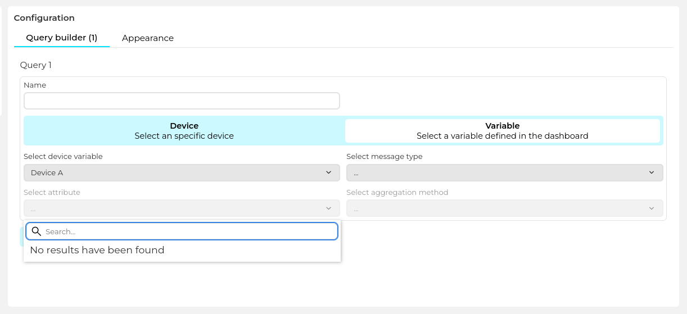

# How to use dashboard variables

## Introduction

Dashboard variables allow users to make dashboard panels more dynamic. Instead of hardcoding specific devices in the panels, device selectors can be added to the dashboard. Those selectors are displayed in the main dashboard view, and the selected value can be changed by the final users at any time. Changing the value updates the data for all the panels that are using that variable.
  
The dashboard variables are defined at dashboard level. Then they can be used when defining the panel queries.

## Prerequisites

The dashboard has to be pre-created, and at least one device is needed.

## Define dashboard variables

The variables are created from the dashboard edition view. For that click on the “pencil” icon in the dashboard toolbar.

Creating a variable only requires specifying a name and selecting a device-type.
  

The dashboard variables are always device-type specific to ensure that all the selectable devices are compatible with the dashboard panel queries in which the variable is used.

Up to 4 variables can be defined.

## Use dashboard variables

Once a dashboard variable is defined it can be used when defining dashboard panel queries. The same variable can be used in multiple queries and panels.
  

For that, click on the “Variable, select a variable defined in the dashboard” in the query builder. Then select a specific variable from the list. Continue with the rest of the form as when selecting a specific device.

The dashboard variable is now ready to use. Changing the device in the dashboard view will update the corresponding panels.
