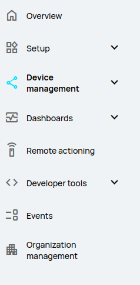
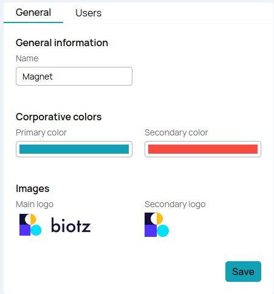

# How to use organization management/general

This interface allows you to manage and customize various aspects of your organization's presence and settings for the platform.

To access the organization management interface, follow these steps:

1. **Navigate to 'Organization Management' in the left-hand toolbar:**
   - Locate and click on 'Organization Management' listed in the toolbar.

  
  
  
This will open the interface dedicated to managing organizational settings.

### Organization Management Interface

In the Organization Management interface, you can perform the following actions:

#### Change Organization Name

- Update the name of your organization as needed.

#### Choose Primary and Secondary Colors

- Select primary and secondary colors for the platform's theme  from a picker of 12 different colors by clicking on the color bar.

#### Upload Primary and Secondary Logos

- Upload primary and secondary logos for branding purposes. To upload a new logo, click on the current logo displayed. A dialog box will open allowing you to select the new logo file from your computer.

  

After making all necessary updates, remember to save your changes by clicking the 'Save' button.