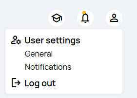
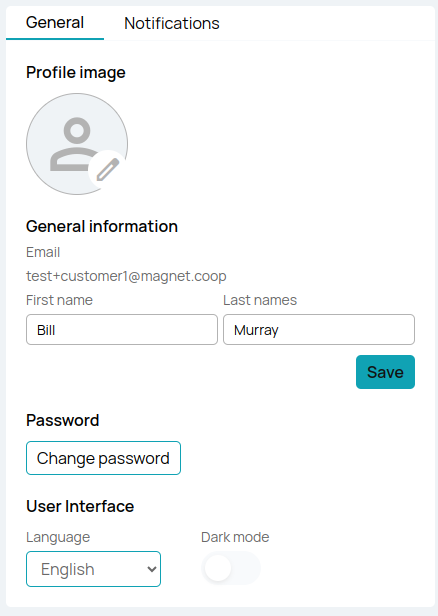
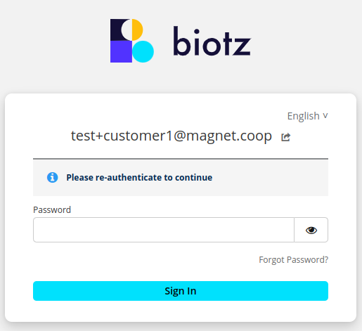
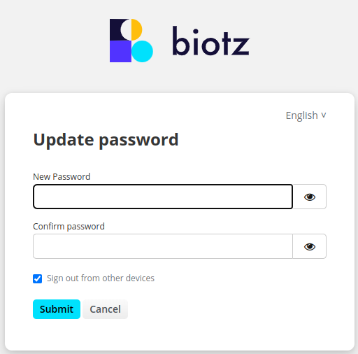
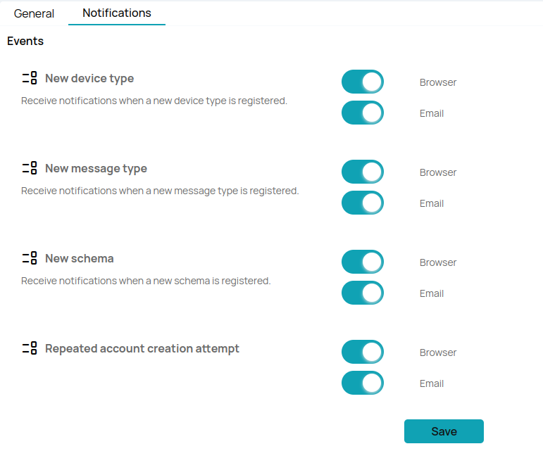
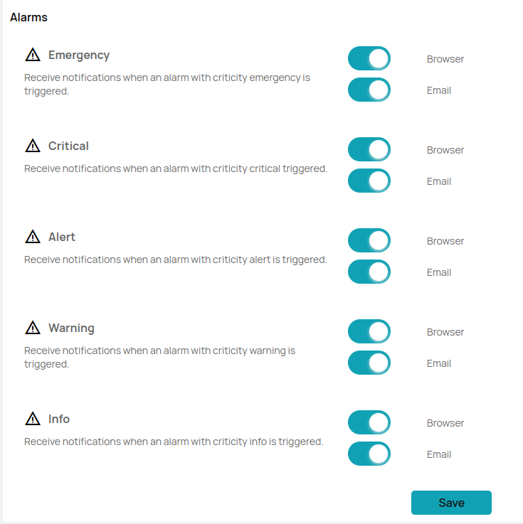

To access your user settings in the Biotz platform, follow these steps:

1. **Navigate to the Settings Menu:**
   - In the top right corner of the platform, you will see three icons.
   - Click on the icon located on the far right.

    

2. **Options Available:**
   - Upon clicking the icon, you will have the option to do certain events:
     - **General:** Manage general account preferences and details.
     - **Notifications:** Configure notifications for events and alarms.
     - **Log Out:** End your current session and log out of the platform.

## General settings

If the user decides to click on general, the following interface will appear:

    

In this section, the user can customize their profile and adjust some interface settings. Below are the details of each available setting:

### Profile Image
The user can choose a profile image. This image will be visible on their profile and in other sections of the system where their user is displayed.

### Email
The user's email will be displayed below the profile image. This field is read-only and cannot be directly modified from this section.

### Change First Name and Last Name
The user can change their first name and last name. These fields will be editable, and changes made will be saved by clicking on the "save" button.

### Change Password
To change the password, the user must follow these steps:

1. Click on the "Change Password" button.
2. Authenticate their identity by re-entering the current password.

    

3. Once authenticated, another tab will open where the password can be changed.

    

### Interface Settings

#### Language
The user can choose between three options for the interface language: Spanish, English, or Auto Detect. This setting can be adjusted using a dropdown menu.

#### Interface Mode
The user can switch between light mode and dark mode according to their preference. This setting can be adjusted with a toggle switch.

## Notification Settings

If the user chooses to click on notifications the user will be able to configure notifications for different types. There are two types of notifications: Events and Alarms. The user can choose to receive notifications in the browser and via email using toggle switches.

### Events Notifications

    

The user can choose which specific events to receive notifications for.
Select the events you want to receive notifications for. Each event corresponds to a specific action within the system:

- New device type
- New message type
- New schema

You will also be able to receive notifications when multiple attempts are made to create an account.

### Alarm Notifications

    

Configure notifications for different types of alarms based on their severity:

#### Emergency
Receive notifications for alarms indicating severe and urgent issues that require immediate attention.

#### Critical
Receive notifications for alarms indicating critical issues that need prompt attention to prevent significant problems or disruptions.

#### Alert
Receive notifications for alarms indicating important conditions that may require action to avoid potential problems.

#### Warning
Receive notifications for alarms indicating potential issues or conditions that could lead to problems if not addressed.

#### Info
Receive informational notifications that provide additional details or updates for monitoring purposes.

