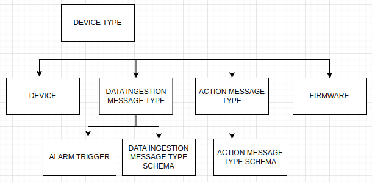

# Glossary
**Device type**: Biotz allows managing multiple different devices from the same account. “Types” are a way of grouping those devices.

**Device**: a device in Biotz corresponds to a single device in the physical world. There should be a one to one mapping between the IOT devices and the devices registered in Biotz.
‍

**Data ingestion flow**: a data ingestion flow is the process of receiving data from the devices and persisting it in the database.

- Data ingestion message type: each device type can have multiple message types for data ingestion.That means that the devices of that type can send different types of messages to the platform. 
- Data ingestion message type schema: each data ingestion message type can have multiple schemas. That means that the devices can send the same message type data in different formats/shapes. For example, different devices of the same type might be sending the same data in a slightly different format because they are running different firmware versions. Or the same device might change its data schema during its life cycle.
**Alarms**:

- Alarm trigger: an alarm trigger is a rule that defines when an alarm should be triggered. The triggers are specific to data ingestion message type schemas because they depend on the data attributes.
- Alarm: an alarm is the result of an alarm trigger being triggered. The alarm is triggered for a specific device.
Dashboards:

**Dashboard**: 
- Panel:a dashboard can have one or more visualization/charts. Each of them is called a panel.
- Variable: device selector that is defined at the dashboard level. Panels can use variables to make the device being viewed changeable by the final user.

**Firmware**

**Event**: an event is something that happened within the Biotz platform and has been registered for tracking purposes. For example, when a user joins an organization an event is registered. The events can sometimes generate notifications for the users.

    

