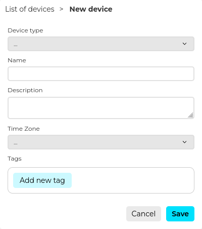
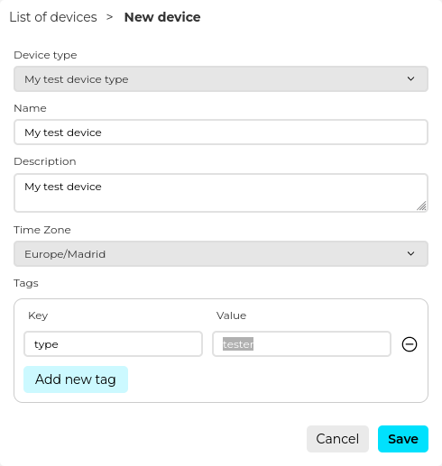

# Creating a device

Before sending any data you need to register a device. To do so, from the sidebar, in the **Device Management** section, click on **Devices**. This will show up a list of devices. In the top right corner you click on **New device**. You will see the following form:
            

From the **Device type** dropdown list select **My test device type**. Remember that this device type contains all the configuration you have done before. For the name input **My test device** and the same for **Description**. For the **Timezone** select your time zone. Finally, you can optionally add **Tags** to your new device. **Tags** are just key value pairs that serve as metadata about your device. Add one by clicking on **Add new tag**. You can add as many tags as you desire. Tags are useful to filter your devices for example or to add additional information to them.

Now, click on **Save**. By doing so, Biotz will register the new device in the platform and perform certain actions to create the credentials for your device. Once it is done, you will automatically download the device credentials file. In the credentials file you will have important and sensitive information about your device. Among other things it contains the username and password of your device that is required to interact with Biotz services. Even though this is a tutorial, bear in mind that the credentials file should be stored in a safe place and avoid sharing it over the network. With this information before sending data to Biotz we need to <a href="./Step 5 - Authenticating  a device" target="_self">authenticate and get our token</a>.

‍